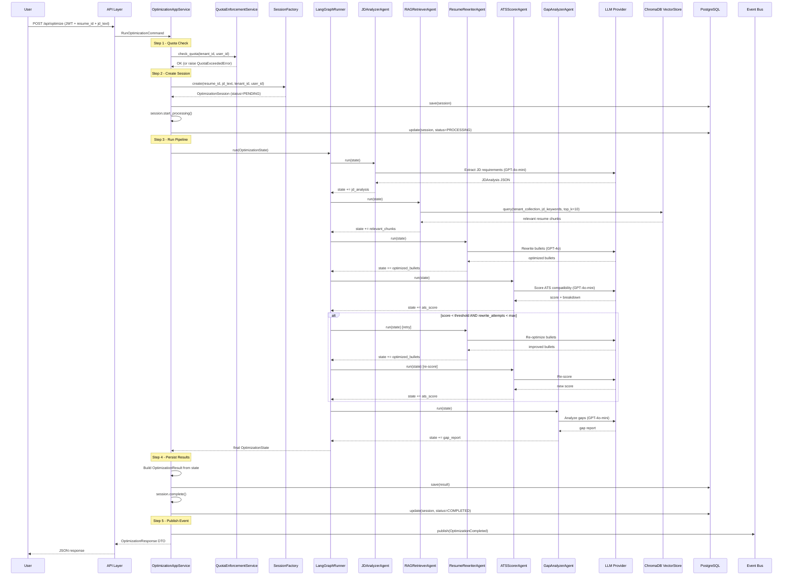
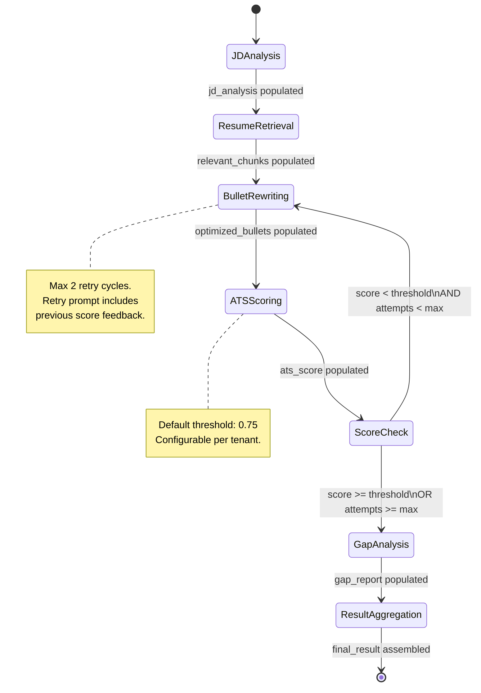
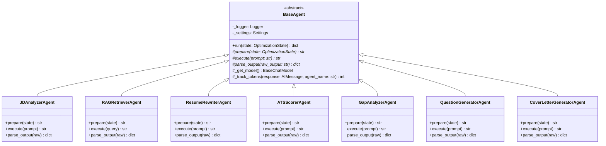
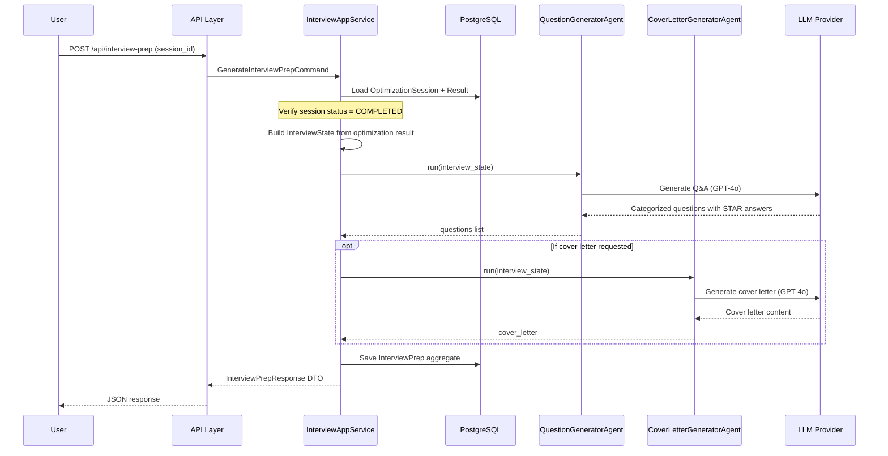
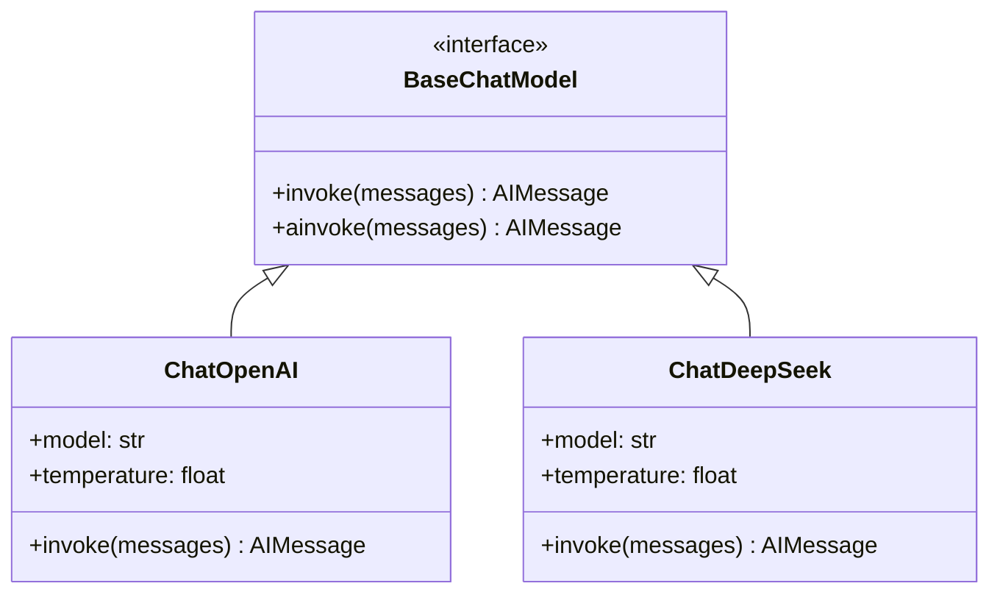

# JobFit AI — AI Workflow Orchestration Architecture

This document is the definitive blueprint for implementing the **Optimization Pipeline** (5 LangGraph agents) and the **Interview Preparation Module** (2 agents). It expands on the high-level design in [System Architecture](02-system-architecture.md) Section 9 with implementation-level detail: full state schemas, per-agent specifications, prompt strategies, error handling, and token budgeting.

**Audience**: Person A (AI Workflow developer)
**Bounded Contexts Covered**: `optimization/`, `interview/`

---

## 1. Pipeline Overview and Data Flow

### 1.1 Architecture Boundary

The AI workflow spans two DDD layers:

| Layer | Responsibility | Key Files |
|-------|---------------|-----------|
| **Application Layer** | Orchestrates the use case: creates the session, invokes the graph, persists results, publishes domain events. | `optimization/application/services.py` |
| **Infrastructure Layer** | Contains all LangGraph and LLM code: agent implementations, graph definition, ChromaDB queries. | `optimization/infrastructure/agents/` |

The Application Layer **never** touches LangChain or LangGraph directly. It depends on a `IGraphRunner` interface (defined in the Domain Layer), which the Infrastructure Layer implements. This keeps the domain pure.

```
┌─────────────────────────────────────────────────────────────┐
│  API Layer (routes.py)                                      │
│    POST /api/optimize  →  RunOptimizationCommand            │
└────────────────────┬────────────────────────────────────────┘
                     │
┌────────────────────▼────────────────────────────────────────┐
│  Application Layer (services.py)                            │
│    OptimizationApplicationService.run_optimization()        │
│      1. Check quota (Billing context)                       │
│      2. Create OptimizationSession (Factory)                │
│      3. Invoke IGraphRunner.run(state)                      │
│      4. Persist OptimizationResult                          │
│      5. Publish OptimizationCompleted event                 │
└────────────────────┬────────────────────────────────────────┘
                     │  IGraphRunner interface
┌────────────────────▼────────────────────────────────────────┐
│  Infrastructure Layer (agents/)                             │
│    LangGraphRunner implements IGraphRunner                  │
│      → Compiles and invokes the StateGraph                  │
│      → Each node delegates to a BaseAgent subclass          │
└─────────────────────────────────────────────────────────────┘
```

### 1.2 End-to-End Sequence Diagram



### 1.3 Cross-Context Dependencies

| Dependency | Upstream Context | Downstream Context | Pattern | Detail |
|-----------|-----------------|-------------------|---------|--------|
| Resume parsed sections | Resume | Optimization | **Customer-Supplier** | RAG Retriever queries Resume's ChromaDB collection (`tenant_{tenant_id}`). Optimization reads but never writes to Resume's vector store. |
| Optimization results | Optimization | Interview | **Customer-Supplier** | Interview context loads a completed `OptimizationSession` to generate questions and cover letters. |
| Token usage tracking | Optimization | Billing | **Published Language** | `OptimizationCompleted` domain event carries `tokens_used` for billing to record. |

---

## 2. LangGraph State Schema

### 2.1 OptimizationState

The central data structure passed through every node in the LangGraph state machine. Each node reads the fields it needs and returns a **partial state update** (only the fields it modifies).

```python
from typing import TypedDict


class JDAnalysisDict(TypedDict):
    """Structured output from the JD Analyzer agent."""

    hard_skills: list[str]          # e.g., ["Python", "AWS", "Docker"]
    soft_skills: list[str]          # e.g., ["leadership", "communication"]
    responsibilities: list[str]     # Key job responsibilities
    qualifications: list[str]       # Required qualifications/experience
    keyword_weights: dict[str, float]  # keyword -> importance weight (0.0-1.0)


class ResumeChunkDict(TypedDict):
    """A single retrieved resume chunk from the vector store."""

    section_type: str       # e.g., "experience", "projects", "skills"
    content: str            # Raw text content of the chunk
    relevance_score: float  # Cosine similarity score (0.0-1.0)


class ScoreBreakdownDict(TypedDict):
    """Per-category ATS score breakdown."""

    keywords: float     # Keyword match score (0.0-1.0)
    skills: float       # Skills alignment score (0.0-1.0)
    experience: float   # Experience relevance score (0.0-1.0)
    formatting: float   # ATS formatting compliance score (0.0-1.0)


class GapReportDict(TypedDict):
    """Structured output from the Gap Analyzer agent."""

    missing_skills: list[str]                  # Skills required by JD but absent from resume
    recommendations: list[str]                 # Actionable suggestions to address gaps
    transferable_skills: list[str]             # Existing skills that partially map to gaps
    priority: dict[str, str]                   # skill -> "high" | "medium" | "low"


class AgentErrorDict(TypedDict):
    """Record of an error that occurred during pipeline execution."""

    agent_name: str     # Which agent failed
    error_type: str     # Exception class name
    error_message: str  # Human-readable error description
    recoverable: bool   # Whether the pipeline continued after this error


class OptimizationState(TypedDict, total=False):
    """Shared state passed through the LangGraph state machine.

    Fields marked as inputs are set before graph invocation.
    Fields marked as outputs are written by specific agent nodes.
    Fields with total=False are optional — not all are present at every step.
    """

    # --- Inputs (set by Application Layer before graph invocation) ---
    tenant_id: str              # From JWT context
    user_id: str                # From JWT context
    session_id: str             # Created by SessionFactory
    jd_text: str                # Raw job description text from user
    resume_sections: list[dict] # Parsed resume sections from Resume context

    # --- JD Analysis (written by JDAnalyzerAgent) ---
    jd_analysis: JDAnalysisDict

    # --- Retrieval (written by RAGRetrieverAgent) ---
    relevant_chunks: list[ResumeChunkDict]

    # --- Rewriting (written by ResumeRewriterAgent) ---
    optimized_bullets: list[str]   # Rewritten bullet points
    rewrite_attempts: int          # Number of rewrite iterations (starts at 0, max 2)

    # --- Scoring (written by ATSScorerAgent) ---
    ats_score: float               # Overall ATS score (0.0-1.0)
    score_breakdown: ScoreBreakdownDict

    # --- Gap Analysis (written by GapAnalyzerAgent) ---
    gap_report: GapReportDict

    # --- Pipeline Control ---
    score_threshold: float         # Minimum acceptable ATS score (default: 0.75)
    max_rewrite_attempts: int      # Max retry cycles (default: 2)
    current_node: str              # Name of the currently executing node
    errors: list[AgentErrorDict]   # Accumulated non-fatal errors

    # --- Token Tracking (accumulated by each agent) ---
    token_usage: dict[str, int]    # agent_name -> tokens_used
    total_tokens_used: int         # Sum across all agents

    # --- Final Output (written by ResultAggregator) ---
    final_result: dict             # Aggregated result for API response
```

### 2.2 InterviewState

A simpler state used by the interview pipeline. No LangGraph needed — agents are called sequentially by the application service.

```python
class InterviewState(TypedDict, total=False):
    """State for interview preparation pipeline.

    Not a LangGraph state — used as a plain data container passed
    between the QuestionGenerator and CoverLetterGenerator agents.
    """

    # --- Inputs ---
    tenant_id: str
    user_id: str
    session_id: str                     # Reference to completed OptimizationSession
    jd_analysis: JDAnalysisDict         # From optimization result
    optimized_resume_content: list[str] # Optimized bullet points
    original_resume_sections: list[dict]

    # --- Question Generation Output ---
    questions: list[dict]   # List of InterviewQuestionDict
    # Each: { category, question_text, suggested_answer, difficulty }

    # --- Cover Letter Output ---
    cover_letter: str       # Generated cover letter content
    cover_letter_tone: str  # "formal" | "conversational" | "enthusiastic"

    # --- Token Tracking ---
    token_usage: dict[str, int]
    total_tokens_used: int
```

### 2.3 State Initialization

Before invoking the graph, the Application Layer constructs the initial state:

```python
initial_state: OptimizationState = {
    "tenant_id": command.tenant_id,
    "user_id": command.user_id,
    "session_id": str(session.id),
    "jd_text": command.jd_text,
    "resume_sections": parsed_sections,    # Loaded from Resume context
    "score_threshold": 0.75,               # Configurable per tenant
    "max_rewrite_attempts": 2,
    "rewrite_attempts": 0,
    "errors": [],
    "token_usage": {},
    "total_tokens_used": 0,
}
```

---

## 3. Agent Specifications

### 3.1 Agent Summary Table

| # | Agent | File | LLM Model | LLM Call? | Est. Tokens | Est. Latency |
|---|-------|------|-----------|-----------|-------------|-------------|
| 1 | JD Analyzer | `jd_analyzer.py` | GPT-4o-mini | Yes | 800-1,500 | 2-4s |
| 2 | RAG Retriever | `rag_retriever.py` | — | No (vector search) | 0 | 0.5-1s |
| 3 | Resume Rewriter | `resume_rewriter.py` | GPT-4o | Yes | 1,500-3,000 | 5-15s |
| 4 | ATS Scorer | `ats_scorer.py` | GPT-4o-mini | Yes | 600-1,200 | 2-4s |
| 5 | Gap Analyzer | `gap_analyzer.py` | GPT-4o-mini | Yes | 500-1,000 | 2-3s |
| — | **Total (single pass)** | — | — | — | **3,400-6,700** | **12-27s** |
| — | **Total (with 1 retry)** | — | — | — | **5,500-10,900** | **19-46s** |

All estimates assume a typical resume (1-2 pages) and JD (300-800 words). The < 60-second NFR target (doc 01 Section 5) is achievable even with one rewrite retry cycle.

---

### 3.2 JD Analyzer Agent

**File**: `optimization/infrastructure/agents/jd_analyzer.py`

**Responsibility**: Extract structured requirements from raw job description text.

| Aspect | Detail |
|--------|--------|
| **Reads from state** | `jd_text` |
| **Writes to state** | `jd_analysis: JDAnalysisDict`, `token_usage["jd_analyzer"]` |
| **LLM Model** | GPT-4o-mini (structured extraction — high accuracy, low cost) |
| **Temperature** | 0.0 (deterministic extraction) |

**Prompt Strategy**:

```
System: You are a job description analysis expert. Extract structured requirements
from the provided JD. Respond ONLY with valid JSON matching the schema below.

Schema:
{
  "hard_skills": ["string"],       // Technical skills explicitly mentioned
  "soft_skills": ["string"],       // Non-technical / interpersonal skills
  "responsibilities": ["string"],  // Key duties of the role
  "qualifications": ["string"],    // Required education, certifications, years of experience
  "keyword_weights": {             // Importance weight based on frequency and position
    "skill_name": 0.0-1.0
  }
}

User: <jd_text>
```

**Output Schema** (`parse_output` validates):

```json
{
  "hard_skills": ["Python", "AWS", "Docker", "CI/CD"],
  "soft_skills": ["leadership", "communication", "problem-solving"],
  "responsibilities": ["Design and maintain microservices", "Lead code reviews"],
  "qualifications": ["5+ years backend experience", "BS in Computer Science"],
  "keyword_weights": { "Python": 0.95, "AWS": 0.85, "Docker": 0.70 }
}
```

**Error Handling**:

| Failure Mode | Recovery |
|-------------|----------|
| LLM returns invalid JSON | Retry once with a stricter prompt ("Your previous response was not valid JSON. Try again.") |
| LLM timeout (> 30s) | Raise `AgentExecutionError`; pipeline aborts, session status set to FAILED |
| Empty or nonsensical JD text | Raise `ValidationError("JD text is too short or unintelligible")` in `prepare()` before LLM call |

---

### 3.3 RAG Retriever Agent

**File**: `optimization/infrastructure/agents/rag_retriever.py`

**Responsibility**: Retrieve the most relevant resume sections for JD requirements via vector similarity search.

| Aspect | Detail |
|--------|--------|
| **Reads from state** | `tenant_id`, `jd_analysis` (specifically `hard_skills`, `soft_skills`, `keyword_weights`) |
| **Writes to state** | `relevant_chunks: list[ResumeChunkDict]` |
| **LLM Model** | None — pure vector search (no LLM cost) |
| **Vector Store** | ChromaDB collection `tenant_{tenant_id}` |
| **Embedding Model** | OpenAI `text-embedding-3-small` (1536 dimensions) |

**Retrieval Strategy**:

1. **Build query text**: Concatenate high-weight JD keywords into a single query string, weighted by `keyword_weights`. Format: `"Python AWS Docker microservices leadership"`.
2. **Query ChromaDB**: Perform similarity search with `top_k=10` against the tenant's vector collection.
3. **Filter by relevance**: Discard chunks with `relevance_score < 0.3` (low similarity noise).
4. **Sort and deduplicate**: Order by relevance score descending; remove duplicate content.

**Cross-Context Read Pattern**:

The RAG Retriever reads from Resume context's ChromaDB collection but does not write to it. This follows the Customer-Supplier pattern: Resume context (upstream) owns the vector store; Optimization context (downstream) consumes it as read-only.

```python
# Infrastructure adapter — wraps ChromaDB client
class VectorStoreReader:
    """Read-only adapter for Resume context's vector store."""

    def query(
        self,
        tenant_id: str,
        query_text: str,
        top_k: int = 10,
    ) -> list[ResumeChunkDict]:
        collection_name = f"tenant_{tenant_id}"
        # ChromaDB query with embedding
        ...
```

**Error Handling**:

| Failure Mode | Recovery |
|-------------|----------|
| ChromaDB collection not found | Return empty `relevant_chunks`; log warning. Resume Rewriter will operate with `resume_sections` from state as fallback. |
| ChromaDB connection timeout | Retry once (1s backoff); if still failed, fall back to using raw `resume_sections` without vector ranking. |
| Zero results returned | Proceed with empty chunks; Resume Rewriter uses full `resume_sections`. Log warning for user visibility. |

---

### 3.4 Resume Rewriter Agent

**File**: `optimization/infrastructure/agents/resume_rewriter.py`

**Responsibility**: Rewrite resume bullet points to align with JD keywords, improve ATS compatibility, and strengthen achievement-oriented language.

| Aspect | Detail |
|--------|--------|
| **Reads from state** | `jd_analysis`, `relevant_chunks` (or `resume_sections` fallback), `rewrite_attempts`, `ats_score` (on retry), `score_breakdown` (on retry) |
| **Writes to state** | `optimized_bullets: list[str]`, `rewrite_attempts` (incremented), `token_usage["resume_rewriter"]` |
| **LLM Model** | GPT-4o (creative rewriting requires strong language generation) |
| **Temperature** | 0.7 (allow creativity while maintaining professionalism) |

**Prompt Strategy**:

First attempt:
```
System: You are an expert resume writer and ATS optimization specialist.
Rewrite the candidate's resume bullet points to maximize alignment with the
target job description. Follow these rules:
1. Embed relevant JD keywords naturally (do NOT keyword-stuff).
2. Start each bullet with a strong action verb.
3. Quantify achievements with numbers, percentages, or dollar amounts where possible.
4. Preserve factual accuracy — do NOT fabricate experiences.
5. Maintain professional tone appropriate for ATS systems.

User:
## Target JD Requirements
Hard Skills: {jd_analysis.hard_skills}
Soft Skills: {jd_analysis.soft_skills}
Key Responsibilities: {jd_analysis.responsibilities}
Keyword Weights: {jd_analysis.keyword_weights}

## Candidate's Relevant Experience
{relevant_chunks formatted as sections}

Rewrite the bullet points. Return a JSON array of strings, one per bullet point.
```

Retry prompt (when `rewrite_attempts > 0`):
```
System: [same as above, plus:]
The previous rewrite scored {ats_score:.0%} on ATS compatibility.
Score breakdown: keywords={keywords:.0%}, skills={skills:.0%},
experience={experience:.0%}, formatting={formatting:.0%}.

Focus on improving the weakest categories. Specifically:
- If keywords score is low: integrate more JD-specific terminology.
- If experience score is low: strengthen relevance to JD responsibilities.
- If formatting score is low: use cleaner bullet structure.
```

**Output Schema**:

```json
[
  "Architected and deployed 3 microservices on AWS ECS, reducing deployment time by 40%",
  "Led cross-functional team of 5 engineers to deliver CI/CD pipeline using Docker and GitHub Actions",
  "Optimized Python backend API performance, achieving 99.9% uptime and 200ms p95 latency"
]
```

**Error Handling**:

| Failure Mode | Recovery |
|-------------|----------|
| LLM returns non-JSON or malformed array | Retry once with explicit format instruction. If still fails, wrap raw text as single-element array. |
| LLM timeout (> 45s) | Raise `AgentExecutionError`; this is the most token-heavy call and most likely to timeout. |
| Output contains fabricated content | Not detectable at agent level; users verify via side-by-side comparison in the UI. Prompt explicitly instructs "do NOT fabricate." |

---

### 3.5 ATS Scorer Agent

**File**: `optimization/infrastructure/agents/ats_scorer.py`

**Responsibility**: Evaluate ATS compatibility of optimized resume content against JD requirements.

| Aspect | Detail |
|--------|--------|
| **Reads from state** | `jd_analysis`, `optimized_bullets` |
| **Writes to state** | `ats_score: float`, `score_breakdown: ScoreBreakdownDict`, `token_usage["ats_scorer"]` |
| **LLM Model** | GPT-4o-mini (evaluation/scoring task — structured output) |
| **Temperature** | 0.0 (deterministic scoring) |

**Prompt Strategy**:

```
System: You are an ATS (Applicant Tracking System) scoring engine.
Evaluate the optimized resume bullet points against the target JD requirements.
Score each category from 0.0 to 1.0 and provide an overall weighted score.

Scoring categories and weights:
- keywords (0.35): How many JD keywords appear in the resume bullets?
- skills (0.30): How well do the demonstrated skills match JD requirements?
- experience (0.25): How relevant is the experience to JD responsibilities?
- formatting (0.10): Are bullets clear, concise, and ATS-parseable?

Respond ONLY with valid JSON:
{
  "overall": 0.0-1.0,
  "keywords": 0.0-1.0,
  "skills": 0.0-1.0,
  "experience": 0.0-1.0,
  "formatting": 0.0-1.0
}

User:
## JD Requirements
{jd_analysis}

## Optimized Resume Bullets
{optimized_bullets}
```

**Output Schema**:

```json
{
  "overall": 0.82,
  "keywords": 0.90,
  "skills": 0.85,
  "experience": 0.75,
  "formatting": 0.80
}
```

**Error Handling**:

| Failure Mode | Recovery |
|-------------|----------|
| LLM returns invalid JSON | Retry once. If still invalid, assign default score of 0.5 with a warning in `errors`. |
| Score values outside 0.0-1.0 | Clamp to [0.0, 1.0] in `parse_output()`. Log warning. |
| LLM timeout | Retry once. If failed, assign default 0.5 score and proceed to Gap Analysis. |

---

### 3.6 Gap Analyzer Agent

**File**: `optimization/infrastructure/agents/gap_analyzer.py`

**Responsibility**: Identify JD-required skills missing from the optimized resume and provide actionable recommendations.

| Aspect | Detail |
|--------|--------|
| **Reads from state** | `jd_analysis`, `optimized_bullets`, `score_breakdown` |
| **Writes to state** | `gap_report: GapReportDict`, `token_usage["gap_analyzer"]` |
| **LLM Model** | GPT-4o-mini (analytical comparison task) |
| **Temperature** | 0.2 (mostly factual, slight flexibility for recommendations) |

**Prompt Strategy**:

```
System: You are a career gap analysis expert. Compare the job description
requirements against the candidate's optimized resume. Identify gaps and
provide actionable recommendations.

Respond ONLY with valid JSON:
{
  "missing_skills": ["string"],        // JD skills not found in resume
  "recommendations": ["string"],       // Actionable advice to address each gap
  "transferable_skills": ["string"],   // Existing skills that partially cover gaps
  "priority": { "skill": "high|medium|low" }  // Urgency of each gap
}

User:
## JD Requirements
Hard Skills: {jd_analysis.hard_skills}
Soft Skills: {jd_analysis.soft_skills}
Qualifications: {jd_analysis.qualifications}

## Optimized Resume Content
{optimized_bullets}

## Current ATS Score Breakdown
{score_breakdown}
```

**Output Schema**:

```json
{
  "missing_skills": ["Kubernetes", "Terraform"],
  "recommendations": [
    "Add any Kubernetes experience from side projects or certifications",
    "Highlight infrastructure-as-code experience even if not Terraform-specific"
  ],
  "transferable_skills": ["Docker (related to Kubernetes)", "AWS CloudFormation (related to Terraform)"],
  "priority": { "Kubernetes": "high", "Terraform": "medium" }
}
```

**Error Handling**:

| Failure Mode | Recovery |
|-------------|----------|
| LLM returns invalid JSON | Retry once. If still invalid, return empty gap report with warning. |
| LLM timeout | Return empty gap report; pipeline continues. Gap analysis is valuable but not critical. |

---

### 3.7 Performance-Optimized Execution Profile (V2)

This profile is the default recommendation for production to reduce latency and token usage while preserving output quality.

#### 3.7.1 Fast-Path Scoring (Rule-Based First, LLM Fallback)

Before invoking `ATSScorerAgent`, run a deterministic pre-score:

1. **Keyword coverage**: overlap of `jd_analysis.hard_skills` and `optimized_bullets`.
2. **Section relevance**: check whether rewritten bullets map to top responsibilities.
3. **Formatting checks**: bullet structure, numeric achievements, sentence length.

If rule-based confidence is high (`confidence >= 0.85`), skip LLM scoring and use deterministic scores.  
If confidence is medium (`0.60 <= confidence < 0.85`), call `ATSScorerAgent` with compact input (top weak areas only).  
If confidence is low (`confidence < 0.60`), call full `ATSScorerAgent`.

| Mode | LLM Scoring | Token Cost | Use Case |
|------|-------------|------------|----------|
| High confidence | No | ~0 | Clear matches, stable output |
| Medium confidence | Partial | 200-500 | Borderline results |
| Low confidence | Full | 600-1,200 | Ambiguous or weak matches |

#### 3.7.2 Compact Context Policy for Rewriter

Do not pass full resume content by default. Rewriter input is capped:

- `top_k` chunks: default `6` (max `8` only for complex JDs)
- `max_chunk_chars`: `900` per chunk
- `max_rewriter_input_tokens`: `2200` hard cap
- include only top `10` weighted JD keywords in prompt body

This avoids unbounded prompt growth and improves model focus.

#### 3.7.3 Two-Stage Rewrite Strategy

Replace expensive full retries with targeted repair:

- **Stage A (Full Rewrite)**: one full rewrite call.
- **Stage B (Targeted Repair)**: if score below threshold, run a focused patch prompt only on weak categories and only on affected bullets.
- **No second full rewrite** unless explicitly enabled by tenant config.

Expected impact:

- 25-40% lower average rewrite tokens
- 15-30% lower optimization latency

#### 3.7.4 Model Routing Policy

Default per-agent routing:

| Agent | Default Model | Downgrade Path | Upgrade Path |
|------|----------------|----------------|-------------|
| JD Analyzer | GPT-4o-mini | n/a | GPT-4o for noisy JDs |
| RAG Retriever | none | n/a | n/a |
| Resume Rewriter | GPT-4o | GPT-4o-mini for short/simple resumes | keep GPT-4o for complex JDs |
| ATS Scorer | Rule-based + GPT-4o-mini fallback | rule-based only for high confidence | GPT-4o for dispute/debug mode |
| Gap Analyzer | GPT-4o-mini | deterministic gap diff only | GPT-4o for premium quality mode |

#### 3.7.5 Revised Pipeline Budget (Target)

| Scenario | Previous Range | V2 Target |
|----------|----------------|-----------|
| Optimization (single pass) | 3,400-6,700 | 2,400-4,800 |
| Optimization (with retry) | 5,500-10,900 | 3,200-6,200 |
| Interview Q&A only | 2,000-4,000 | 1,400-3,000 |
| Interview + cover letter | 3,000-6,000 | 2,100-4,200 |

## 4. State Graph Topology and Conditional Logic

### 4.1 Graph Definition

```python
from langgraph.graph import StateGraph, START, END

from optimization.infrastructure.agents.jd_analyzer import jd_analyzer_node
from optimization.infrastructure.agents.rag_retriever import rag_retriever_node
from optimization.infrastructure.agents.resume_rewriter import resume_rewriter_node
from optimization.infrastructure.agents.ats_scorer import ats_scorer_node
from optimization.infrastructure.agents.gap_analyzer import gap_analyzer_node
from optimization.infrastructure.agents.graph import result_aggregator_node


def build_optimization_graph() -> StateGraph:
    """Build and compile the optimization pipeline state graph.

    Returns a compiled graph ready for invocation via .invoke() or .ainvoke().
    """
    graph = StateGraph(OptimizationState)

    # --- Register nodes ---
    graph.add_node("jd_analysis", jd_analyzer_node)
    graph.add_node("resume_retrieval", rag_retriever_node)
    graph.add_node("bullet_rewriting", resume_rewriter_node)
    graph.add_node("ats_scoring", ats_scorer_node)
    graph.add_node("gap_analysis", gap_analyzer_node)
    graph.add_node("result_aggregation", result_aggregator_node)

    # --- Define edges ---
    graph.add_edge(START, "jd_analysis")
    graph.add_edge("jd_analysis", "resume_retrieval")
    graph.add_edge("resume_retrieval", "bullet_rewriting")
    graph.add_edge("bullet_rewriting", "ats_scoring")

    # Conditional: score check determines next step
    graph.add_conditional_edges(
        "ats_scoring",
        score_check_router,
        {
            "retry_rewrite": "bullet_rewriting",
            "proceed_to_gap": "gap_analysis",
        },
    )

    graph.add_edge("gap_analysis", "result_aggregation")
    graph.add_edge("result_aggregation", END)

    return graph.compile()
```

### 4.2 Score Check Router

```python
def score_check_router(state: OptimizationState) -> str:
    """Determine whether to retry rewriting or proceed to gap analysis.

    Decision logic:
    - If ATS score >= threshold → proceed to gap analysis
    - If ATS score < threshold AND rewrite_attempts < max → retry rewriting
    - If ATS score < threshold AND rewrite_attempts >= max → proceed anyway
      (we've exhausted retries; give the user the best we have)

    Args:
        state: Current pipeline state with ats_score and rewrite_attempts.

    Returns:
        "retry_rewrite" or "proceed_to_gap" routing key.
    """
    ats_score = state.get("ats_score", 0.0)
    threshold = state.get("score_threshold", 0.75)
    attempts = state.get("rewrite_attempts", 0)
    max_attempts = state.get("max_rewrite_attempts", 2)

    if ats_score >= threshold:
        return "proceed_to_gap"

    if attempts < max_attempts:
        return "retry_rewrite"

    # Exhausted retries — proceed with best available result
    return "proceed_to_gap"
```

### 4.3 Node Function Pattern

Each node is a thin wrapper function that instantiates the corresponding agent, calls `run()`, and returns a partial state update. This keeps LangGraph nodes stateless and agents testable in isolation.

```python
def jd_analyzer_node(state: OptimizationState) -> dict:
    """LangGraph node for JD analysis.

    Instantiates JDAnalyzerAgent, runs it with current state,
    and returns the partial state update.
    """
    agent = JDAnalyzerAgent()
    return agent.run(state)
```

### 4.4 Enhanced State Graph Diagram



### 4.5 Result Aggregator

The final node assembles all outputs into the `final_result` dictionary for the API response:

```python
def result_aggregator_node(state: OptimizationState) -> dict:
    """Aggregate all pipeline outputs into the final result.

    This node performs no LLM calls — it is a pure data assembly step.
    """
    return {
        "final_result": {
            "jd_analysis": state.get("jd_analysis", {}),
            "optimized_bullets": state.get("optimized_bullets", []),
            "ats_score": state.get("ats_score", 0.0),
            "score_breakdown": state.get("score_breakdown", {}),
            "gap_report": state.get("gap_report", {}),
            "rewrite_attempts": state.get("rewrite_attempts", 0),
            "total_tokens_used": state.get("total_tokens_used", 0),
            "token_usage": state.get("token_usage", {}),
            "errors": state.get("errors", []),
        },
        "total_tokens_used": sum(state.get("token_usage", {}).values()),
    }
```

---

### 4.6 Optimized Control Flow and Retry Policy (V2)

To reduce expensive loops, replace the current binary retry route with a triage router.

#### 4.6.1 Router Outcomes

`score_check_router_v2()` returns one of:

- `proceed_to_gap`: score is acceptable or retries exhausted.
- `targeted_repair`: run lightweight rewrite patch on weak dimensions only.
- `full_rewrite`: allowed only once as initial rewrite (or tenant override).

```python
def score_check_router_v2(state: OptimizationState) -> str:
    score = state.get("ats_score", 0.0)
    threshold = state.get("score_threshold", 0.75)
    full_rewrites = state.get("full_rewrite_attempts", 1)
    repair_attempts = state.get("repair_attempts", 0)
    max_repair_attempts = state.get("max_repair_attempts", 1)

    if score >= threshold:
        return "proceed_to_gap"

    # Prefer low-token repair path over full rewrite loop
    if repair_attempts < max_repair_attempts:
        return "targeted_repair"

    # Fail-open with best result after budget-safe attempts
    return "proceed_to_gap"
```

#### 4.6.2 Budget Guardrails (Hard Stops)

Add budget-based stop conditions:

- `max_total_tokens_per_optimization`: default `7000`
- `max_pipeline_latency_ms`: default `55000`
- `max_llm_calls`: default `6`

When any guardrail is exceeded, route directly to `result_aggregation` with a warning in `errors`.

#### 4.6.3 Degrade Modes

If budget pressure is detected mid-run:

1. skip Gap Analyzer (optional quality feature),
2. lower rewrite output length target,
3. switch scorer to rule-based mode only.

This keeps API responses fast and predictable instead of timing out.

## 5. BaseAgent Template Method Design

### 5.1 Class Diagram



### 5.2 BaseAgent Implementation Design

```python
import json
import logging
from abc import ABC, abstractmethod

from langchain_openai import ChatOpenAI


class BaseAgent(ABC):
    """Base agent class implementing the Template Method pattern.

    Subclasses override prepare(), execute(), and parse_output() to define
    specific agent behavior while inheriting the common workflow skeleton.

    The run() method is the template method:
        1. prepare()      — Build the LLM prompt from current state
        2. execute()       — Call the LLM (or vector store, for RAG)
        3. parse_output()  — Validate and structure the raw output

    Cross-cutting concerns handled by BaseAgent:
        - Structured logging at each phase
        - Token usage tracking from LLM response metadata
        - Error wrapping with agent-specific context
        - LLM provider selection via Strategy pattern
    """

    def __init__(self) -> None:
        self._logger = logging.getLogger(self.__class__.__name__)

    def run(self, state: dict) -> dict:
        """Template method: orchestrates prepare -> execute -> parse_output.

        Args:
            state: Current LangGraph state (OptimizationState or InterviewState).

        Returns:
            Partial state update dictionary.

        Raises:
            AgentExecutionError: If any phase fails after retries.
        """
        agent_name = self.__class__.__name__
        self._logger.info("Agent %s starting — prepare phase", agent_name)

        try:
            # Phase 1: Prepare
            prompt = self.prepare(state)
            self._logger.debug("Agent %s prompt built (%d chars)", agent_name, len(prompt))

            # Phase 2: Execute
            self._logger.info("Agent %s — execute phase", agent_name)
            raw_output = self.execute(prompt)
            self._logger.debug("Agent %s raw output (%d chars)", agent_name, len(raw_output))

            # Phase 3: Parse
            self._logger.info("Agent %s — parse phase", agent_name)
            result = self.parse_output(raw_output)
            self._logger.info("Agent %s completed successfully", agent_name)

            return result

        except Exception as exc:
            self._logger.error("Agent %s failed: %s", agent_name, str(exc))
            raise AgentExecutionError(
                agent_name=agent_name,
                message=str(exc),
            ) from exc

    @abstractmethod
    def prepare(self, state: dict) -> str:
        """Build the prompt (or query) from current state.

        Args:
            state: Current pipeline state.

        Returns:
            Prompt string for LLM or query string for vector store.
        """
        ...

    @abstractmethod
    def execute(self, prompt: str) -> str:
        """Execute the LLM call or vector search.

        Args:
            prompt: Prepared prompt or query string.

        Returns:
            Raw output string from LLM or serialized search results.
        """
        ...

    @abstractmethod
    def parse_output(self, raw_output: str) -> dict:
        """Parse and validate the raw output into a partial state update.

        Args:
            raw_output: Raw string from execute().

        Returns:
            Dictionary of state fields to update.
        """
        ...

    def _get_model(
        self,
        model_name: str = "gpt-4o-mini",
        temperature: float = 0.0,
    ) -> ChatOpenAI:
        """Create and return an LLM chat model instance.

        Uses the Strategy pattern — the provider is selected based on
        application configuration (Settings.llm_provider).

        Args:
            model_name: Model identifier (e.g., "gpt-4o", "gpt-4o-mini").
            temperature: Sampling temperature (0.0 = deterministic).

        Returns:
            Configured ChatOpenAI (or ChatDeepSeek) instance.
        """
        # Implementation will read from Settings singleton
        # and return the appropriate LangChain ChatModel
        ...

    def _track_tokens(self, response_metadata: dict, agent_name: str) -> int:
        """Extract and return token count from LLM response metadata.

        Args:
            response_metadata: Metadata dict from LangChain AIMessage.
            agent_name: Name of the agent for tracking.

        Returns:
            Total tokens used in this call.
        """
        token_usage = response_metadata.get("token_usage", {})
        total = token_usage.get("total_tokens", 0)
        self._logger.info(
            "Agent %s token usage: prompt=%d, completion=%d, total=%d",
            agent_name,
            token_usage.get("prompt_tokens", 0),
            token_usage.get("completion_tokens", 0),
            total,
        )
        return total
```

### 5.3 AgentExecutionError

A custom exception defined in the shared domain layer for agent failures:

```python
class AgentExecutionError(DomainError):
    """Raised when an AI agent fails during execution.

    Carries the agent name and original error for structured logging
    and error reporting.
    """

    def __init__(self, agent_name: str, message: str) -> None:
        self.agent_name = agent_name
        super().__init__(f"Agent '{agent_name}' failed: {message}")
```

### 5.4 LLM Retry Strategy

For transient LLM failures (timeouts, rate limits, 5xx errors), agents use LangChain's built-in retry mechanism via `max_retries` on the ChatModel:

```python
def _get_model(self, model_name: str = "gpt-4o-mini", temperature: float = 0.0):
    return ChatOpenAI(
        model=model_name,
        temperature=temperature,
        max_retries=2,              # Retry up to 2 times on transient errors
        request_timeout=30,         # 30-second timeout per call
    )
```

This is separate from the pipeline-level rewrite retry (Section 4.2), which re-runs the Rewriter and Scorer nodes when the ATS score is too low.

---

## 6. Interview Pipeline Architecture

### 6.1 Design Decision: No LangGraph for Interview

The interview pipeline is a simple sequential flow with no conditional branching or retry loops. Using LangGraph would add unnecessary complexity. Instead, the `InterviewApplicationService` orchestrates the agents directly.

| Aspect | Optimization Pipeline | Interview Pipeline |
|--------|----------------------|-------------------|
| Orchestration | LangGraph StateGraph | Sequential function calls |
| Conditional logic | Score-check retry loop | None |
| Agent count | 5 | 2 |
| Shared state | `OptimizationState` (TypedDict) | `InterviewState` (TypedDict) |
| Trigger | `POST /api/optimize` | `POST /api/interview-prep` or `POST /api/cover-letter` |

### 6.2 Interview Pipeline Flow



### 6.3 Question Generator Agent

**File**: `interview/infrastructure/agents/question_generator.py`

**Responsibility**: Generate categorized interview questions with personalized STAR-format answer suggestions.

| Aspect | Detail |
|--------|--------|
| **Reads from state** | `jd_analysis`, `optimized_resume_content`, `original_resume_sections` |
| **Writes to state** | `questions: list[dict]`, `token_usage["question_generator"]` |
| **LLM Model** | GPT-4o (requires nuanced understanding of resume + JD context) |
| **Temperature** | 0.6 (some variety in questions while maintaining relevance) |

**Prompt Strategy**:

```
System: You are an expert interview coach. Generate interview questions based on
the job description and the candidate's resume. For each question, provide a
personalized answer suggestion using the candidate's ACTUAL experience.

Requirements:
1. Generate at least 10 questions total.
2. Categories: behavioral (4+), technical (4+), situational (2+).
3. Behavioral answers MUST use STAR format (Situation, Task, Action, Result).
4. Technical answers should reference specific technologies from the resume.
5. Difficulty levels: easy, medium, hard.

Respond with a JSON array:
[
  {
    "category": "behavioral|technical|situational",
    "question_text": "string",
    "suggested_answer": "string (STAR format for behavioral)",
    "difficulty": "easy|medium|hard"
  }
]

User:
## Job Description Analysis
{jd_analysis}

## Candidate's Optimized Resume
{optimized_resume_content}

## Candidate's Full Background
{original_resume_sections}
```

**Output Schema**:

```json
[
  {
    "category": "behavioral",
    "question_text": "Tell me about a time you led a team through a challenging project.",
    "suggested_answer": "Situation: At [Company], our team faced a tight deadline for migrating ... Task: As tech lead, I was responsible for ... Action: I organized daily standups and ... Result: We delivered 2 days early with zero production incidents.",
    "difficulty": "medium"
  },
  {
    "category": "technical",
    "question_text": "How would you design a CI/CD pipeline for a microservices architecture?",
    "suggested_answer": "Based on my experience building the pipeline at [Company], I would recommend ...",
    "difficulty": "hard"
  }
]
```

### 6.4 Cover Letter Generator Agent

**File**: `interview/infrastructure/agents/cover_letter_generator.py`

**Responsibility**: Generate a tailored cover letter matching JD requirements with the candidate's strongest qualifications.

| Aspect | Detail |
|--------|--------|
| **Reads from state** | `jd_analysis`, `optimized_resume_content`, `cover_letter_tone` |
| **Writes to state** | `cover_letter: str`, `token_usage["cover_letter_generator"]` |
| **LLM Model** | GPT-4o (requires strong writing and tone control) |
| **Temperature** | 0.7 (creative writing with tone variation) |

**Prompt Strategy**:

```
System: You are a professional cover letter writer. Generate a tailored cover
letter based on the job description and the candidate's optimized resume.

Requirements:
1. Address the key requirements from the JD.
2. Highlight the candidate's most relevant achievements.
3. Use the specified tone: {cover_letter_tone}.
4. Length: 3-4 paragraphs (250-400 words).
5. Do NOT use generic phrases like "I am writing to express my interest."
6. Include a compelling opening and confident closing.

Tone descriptions:
- formal: Professional, traditional business letter style
- conversational: Friendly but professional, shows personality
- enthusiastic: Energetic, passionate about the role and company

User:
## Job Requirements
{jd_analysis}

## Candidate's Key Achievements
{optimized_resume_content}

Tone: {cover_letter_tone}
```

### 6.5 Interview Agent Token Estimates

| Agent | LLM Model | Est. Tokens | Est. Latency |
|-------|-----------|-------------|-------------|
| Question Generator | GPT-4o | 2,000-4,000 | 8-15s |
| Cover Letter Generator | GPT-4o | 1,000-2,000 | 5-10s |
| **Total** | — | **3,000-6,000** | **13-25s** |

---

## 7. Cross-Cutting Concerns

### 7.1 LLM Provider Strategy

The `_get_model()` method in `BaseAgent` implements the Strategy pattern for LLM provider selection:



**Selection Logic**:

```python
def _get_model(self, model_name: str, temperature: float) -> BaseChatModel:
    settings = get_settings()  # Singleton

    if settings.llm_provider == "deepseek":
        return ChatOpenAI(
            model="deepseek-chat",
            temperature=temperature,
            openai_api_key=settings.deepseek_api_key,
            openai_api_base="https://api.deepseek.com",
            max_retries=2,
            request_timeout=30,
        )

    # Default: OpenAI
    return ChatOpenAI(
        model=model_name,
        temperature=temperature,
        openai_api_key=settings.openai_api_key,
        max_retries=2,
        request_timeout=30,
    )
```

**Per-Tenant Override (Future)**: In Phase 2, tenant settings can override the global LLM provider. The application service will pass a `provider_override` through the state, and `_get_model()` will check for it.

### 7.2 Token Budget and Cost Estimation

#### Per-Pipeline Token Budget

| Scenario | Total Tokens | Est. Cost (OpenAI) | Est. Cost (DeepSeek) |
|----------|-------------|-------------------|---------------------|
| Optimization (single pass) | 3,400-6,700 | $0.015-$0.035 | $0.002-$0.005 |
| Optimization (1 retry) | 5,500-10,900 | $0.025-$0.055 | $0.004-$0.008 |
| Interview Q&A only | 2,000-4,000 | $0.015-$0.030 | $0.002-$0.004 |
| Interview Q&A + Cover Letter | 3,000-6,000 | $0.020-$0.045 | $0.003-$0.006 |
| **Full pipeline (optimize + interview)** | **8,500-16,900** | **$0.045-$0.100** | **$0.007-$0.014** |

#### Token Tracking Flow

```
Agent.execute()
    → LLM response includes usage metadata
    → Agent._track_tokens() extracts count
    → Agent.run() adds to state["token_usage"][agent_name]
    → ResultAggregator sums into state["total_tokens_used"]
    → AppService reads total from final state
    → OptimizationCompleted event carries tokens_used
    → Billing context records usage
```

### 7.3 Error Handling Matrix

| Error | Source | Severity | Recovery Action | Session Status |
|-------|--------|----------|----------------|---------------|
| JD text too short (< 50 chars) | JD Analyzer `prepare()` | Fatal | Return 400 to user immediately | Not created |
| LLM timeout (single call) | Any LLM agent `execute()` | Recoverable | LangChain retries up to 2x automatically | Continues |
| LLM timeout (all retries exhausted) | Any LLM agent `execute()` | Fatal | `AgentExecutionError` → session FAILED | FAILED |
| LLM rate limit (429) | Any LLM agent `execute()` | Recoverable | LangChain retries with backoff | Continues |
| Invalid JSON from LLM | Any agent `parse_output()` | Recoverable | Re-prompt once with stricter instructions | Continues |
| Invalid JSON (after re-prompt) | Any agent `parse_output()` | Varies | JD/Rewriter: FAILED; Scorer: default 0.5; Gap: empty report | Varies |
| ChromaDB connection error | RAG Retriever | Recoverable | Fall back to raw `resume_sections` | Continues |
| ChromaDB collection not found | RAG Retriever | Recoverable | Return empty chunks; Rewriter uses full resume | Continues |
| ATS score below threshold | Score Check | Expected | Retry rewrite (up to max_rewrite_attempts) | Continues |
| All rewrite retries exhausted | Score Check | Expected | Proceed with best available score | COMPLETED |
| Quota exceeded | Application Service | Fatal | Return 429 to user | Not created |
| Unexpected exception | Any | Fatal | Log full traceback; session FAILED | FAILED |

### 7.4 Observability

#### Structured Logging Format

All agents log in a consistent structured format:

```python
# Log entry format (JSON in production, human-readable in development)
{
    "timestamp": "2026-02-11T10:30:00Z",
    "level": "INFO",
    "logger": "JDAnalyzerAgent",
    "message": "Agent JDAnalyzerAgent completed successfully",
    "context": {
        "session_id": "abc-123",
        "tenant_id": "tenant-456",
        "agent_name": "JDAnalyzerAgent",
        "phase": "parse",          # "prepare" | "execute" | "parse"
        "tokens_used": 1200,
        "latency_ms": 2340
    }
}
```

#### Key Metrics to Track

| Metric | Source | Purpose |
|--------|--------|---------|
| `agent.latency_ms` | BaseAgent `run()` | Performance monitoring per agent |
| `agent.tokens_used` | BaseAgent `_track_tokens()` | Cost tracking and billing |
| `pipeline.total_latency_ms` | Application Service | End-to-end SLA compliance (< 60s) |
| `pipeline.rewrite_attempts` | State `rewrite_attempts` | Quality monitoring — how often retries are needed |
| `pipeline.final_ats_score` | State `ats_score` | Optimization effectiveness |
| `agent.error_count` | State `errors` list | Reliability monitoring |

#### LangSmith Integration

LangGraph natively supports LangSmith tracing. To enable:

```python
# In config.py / environment variables
LANGCHAIN_TRACING_V2=true
LANGCHAIN_API_KEY=<langsmith-api-key>
LANGCHAIN_PROJECT="jobfit-optimization"
```

This provides:
- Full trace of every LLM call with input/output
- Token usage breakdown per call
- Latency waterfall visualization
- Error tracking with full context

### 7.5 Performance Targets

| Metric | Target | Rationale |
|--------|--------|-----------|
| Full optimization pipeline (single pass) | < 30s | Good UX for most cases |
| Full optimization pipeline (with 1 retry) | < 50s | Still within 60s NFR |
| Full optimization pipeline (with 2 retries) | < 60s | Maximum acceptable latency |
| Interview Q&A generation | < 20s | Separate request, simpler pipeline |
| Cover letter generation | < 15s | Single LLM call |
| JD Analyzer agent | < 5s | Fast structured extraction |
| RAG Retriever agent | < 2s | No LLM call, pure vector search |
| Resume Rewriter agent | < 15s | Most complex LLM task |
| ATS Scorer agent | < 5s | Structured evaluation |
| Gap Analyzer agent | < 5s | Analytical comparison |

**Mitigation for slow pipelines**: The frontend displays a real-time progress tracker (ProgressTracker component) showing which agent is currently running. This manages user expectations even if the pipeline approaches the 60s limit.

---

### 7.6 Token, Memory, and Cache Governance (V2)

This section defines mandatory controls for longer memory with lower token use.

#### 7.6.1 Three-Layer Cache Strategy

| Layer | Key | TTL | Value |
|------|-----|-----|-------|
| L1 In-request | function-local | request lifetime | repeated computed values |
| L2 Redis | `tenant:{tenant_id}:jd:{jd_hash}` | 24h | `jd_analysis` |
| L2 Redis | `tenant:{tenant_id}:retrieval:{resume_id}:{jd_hash}` | 12h | top retrieved chunks |
| L2 Redis | `tenant:{tenant_id}:interview:{session_id}:{tone}` | 7d | generated Q&A / cover letter |
| L3 DB artifact | `session_id` | persistent | compact memory profile |

All keys must include `tenant_id` to preserve tenant isolation.

#### 7.6.2 Memory Artifact for Long-Term Context

Introduce a compact `memory_profile` persisted per user/session:

```json
{
  "core_skills": ["Python", "FastAPI", "AWS"],
  "signature_achievements": [
    "Reduced deployment time by 40%",
    "Led team of 5 engineers"
  ],
  "preferred_tone": "professional",
  "accepted_phrasing": ["architected", "optimized", "delivered"]
}
```

Usage policy:

- Interview agents consume `memory_profile` first.
- Full resume text is loaded only if missing required fields.
- After user accepts edits, update memory profile asynchronously.

This improves continuity across sessions with far fewer prompt tokens.

#### 7.6.3 Prompt Compression Rules

Apply to all LLM agents:

- send only dynamic fields; keep static instructions in server templates;
- pass lists in canonical sorted order to reduce token variance;
- limit each instruction block to one responsibility (no mixed directives);
- require strict JSON output and reject verbose prose payloads.

#### 7.6.4 Context Window Budget Allocation

Per-call allocation guidance:

| Segment | Token Budget |
|---------|--------------|
| System instruction | 250-400 |
| JD-derived context | 300-700 |
| Resume/retrieval context | 800-1,600 |
| Output allowance | 400-900 |
| Safety reserve | 10% |

If planned input exceeds budget, prune in this order:

1. drop low-relevance chunks,
2. shorten older experience bullets,
3. keep only top weighted JD terms.

#### 7.6.5 Operational SLO Targets (V2)

| Metric | Previous | V2 Target |
|--------|----------|-----------|
| Avg optimization latency | < 30s (single pass) | < 22s |
| P95 optimization latency | < 60s | < 40s |
| Avg tokens per optimization | 3,400-6,700 | 2,400-4,800 |
| Cache hit rate (jd_analysis) | n/a | >= 60% |
| Cache hit rate (retrieval) | n/a | >= 50% |

## 8. Key Design Decisions

### 8.1 Why LangGraph for Optimization but Not Interview

| Criterion | Optimization | Interview |
|-----------|-------------|-----------|
| Conditional branching | Yes (score-check retry loop) | No |
| Number of agents | 5 (complex orchestration) | 2 (simple sequence) |
| Shared state complexity | High (7+ field groups) | Low (3 field groups) |
| Decision | LangGraph StateGraph | Direct sequential calls |

LangGraph adds value when there is non-trivial control flow. The interview pipeline is a straight line: load data, generate questions, optionally generate cover letter. Adding LangGraph here would be over-engineering.

### 8.2 Why GPT-4o-mini for Extraction/Scoring, GPT-4o for Rewriting

| Task Type | Model | Reasoning |
|-----------|-------|-----------|
| Structured extraction (JD Analyzer) | GPT-4o-mini | Extraction tasks have clear schemas; mini model achieves comparable accuracy at 1/15th the cost. |
| Evaluation/scoring (ATS Scorer) | GPT-4o-mini | Scoring against defined rubrics is well-suited for smaller models. |
| Analytical comparison (Gap Analyzer) | GPT-4o-mini | Comparing two lists (JD vs resume) is a structured task. |
| Creative rewriting (Resume Rewriter) | GPT-4o | Rewriting requires strong language generation, nuance in keyword integration, and maintaining factual accuracy. The quality difference is material here. |
| Interview Q&A generation (Question Generator) | GPT-4o | Generating personalized STAR-format answers requires deep understanding of the candidate's experience. |
| Cover letter writing (Cover Letter Generator) | GPT-4o | Creative writing with tone control benefits from the stronger model. |

### 8.3 Why RAG Retriever Has No LLM Call

The RAG Retriever performs pure vector similarity search:

1. **Cost**: Zero LLM tokens consumed. At scale across tenants, this saves significant cost.
2. **Speed**: ChromaDB queries complete in < 1 second vs. 3-5 seconds for an LLM call.
3. **Determinism**: Vector search is deterministic given the same embeddings; LLM reranking introduces variability.
4. **Simplicity**: The Resume Rewriter already uses GPT-4o to intelligently select which retrieved chunks to incorporate. Adding LLM reranking in the retriever would be redundant.

**Future Enhancement**: In Phase 2, an optional LLM-based reranking step can be added after vector retrieval for improved relevance. This would be implemented as a configurable flag in the state (`use_llm_reranking: bool`).

### 8.4 Node Function vs. Agent Instance Pattern

Each LangGraph node is a **function** (not a class instance) that creates a fresh agent on each invocation:

```python
# Each node creates a fresh agent — no shared mutable state
def jd_analyzer_node(state: OptimizationState) -> dict:
    agent = JDAnalyzerAgent()
    return agent.run(state)
```

This design choice ensures:
- **Thread safety**: No shared state between concurrent pipeline executions across tenants.
- **Testability**: Agents can be unit-tested by instantiating them directly without LangGraph.
- **Simplicity**: No lifecycle management for agent instances.

---

## 9. Implementation Checklist

The following order matches the dependency chain and the suggested order in [CONTRIBUTING.md](../CONTRIBUTING.md) Section 5.3:

| Order | Task | Branch | Key Files | Dependencies |
|-------|------|--------|-----------|-------------|
| 1 | Domain value objects + entities | `feature/optimization-domain-models` | `value_objects.py`, `entities.py`, `factories.py`, `repository.py`, `services.py` | `shared/domain/` (done) |
| 2 | BaseAgent + LangGraph state schema | `feature/optimization-base-agent` | `base_agent.py`, `graph.py` | Step 1 |
| 3 | JD Analyzer agent | `feature/optimization-jd-analyzer` | `jd_analyzer.py` | Step 2 |
| 4 | RAG Retriever agent | `feature/optimization-rag-retriever` | `rag_retriever.py` | Step 2 |
| 5 | Resume Rewriter agent | `feature/optimization-resume-rewriter` | `resume_rewriter.py` | Steps 3, 4 |
| 6 | ATS Scorer agent | `feature/optimization-ats-scorer` | `ats_scorer.py` | Step 5 |
| 7 | Gap Analyzer agent | `feature/optimization-gap-analyzer` | `gap_analyzer.py` | Step 6 |
| 8 | Full pipeline integration + graph wiring | `feature/optimization-pipeline` | `graph.py`, `application/services.py` | Steps 3-7 |
| 9 | Interview question generator | `feature/interview-question-gen` | `question_generator.py` | Step 8 (needs optimization result) |
| 10 | Cover letter generator | `feature/interview-cover-letter` | `cover_letter_generator.py` | Step 9 |

Each step = one branch = one PR (< 400 lines). Write tests first for each step per the project's test-first workflow.
