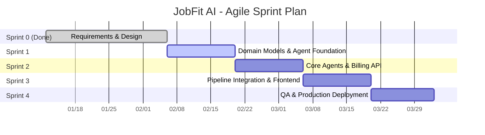

# JobFit AI — Agile Sprint Plan

> **Project**: JobFit AI — Intelligent Resume Optimization Agent (SaaS)
> **Team**: Tomie (Platform & Infrastructure) + Brandy (AI Workflow)
> **Methodology**: Agile (Scrum)
> **Sprint Duration**: 2 weeks
> **Project Timeline**: Jan 12 – Apr 1, 2026

---

## Why Agile

The Waterfall plan (see `waterfall-project-plan.md`) provides a solid sequential baseline but does not account for two realities of this project:

1. **AI agent behavior is unpredictable** — prompt engineering requires fast iteration cycles.
2. **Two developers work in parallel** — Tomie (Platform) and Brandy (AI) have independent workstreams that benefit from frequent integration points.

Agile gives us 2-week checkpoints to demo working software, catch integration issues early, and re-prioritize based on what we learn.

---

## Sprint Overview



| Sprint | Duration | Theme | Status |
|--------|----------|-------|--------|
| **Sprint 0** | Jan 12 – Feb 5 | Requirements, Design, Shared Infra, Identity, Resume | ✅ Done |
| **Sprint 1** | Feb 6 – Feb 19 | Billing domain, Optimization domain, Agent foundation, Frontend auth | 🔄 In Progress |
| **Sprint 2** | Feb 20 – Mar 5 | Core AI agents (Rewriter/Scorer/Gap), Billing API, Resume UI | 🔲 Planned |
| **Sprint 3** | Mar 6 – Mar 19 | Full pipeline wiring, Interview features, All frontend UIs | 🔲 Planned |
| **Sprint 4** | Mar 20 – Apr 1 | E2E testing, Performance tuning, AWS deployment, MVP acceptance | 🔲 Planned |

---

## Sprint 0 — Foundation (DONE)

> Jan 12 – Feb 5 · Pre-development + core infrastructure

**Delivered**:
- Requirements analysis (9 modules, 34 FRs, 11 MVP acceptance criteria)
- System architecture (DDD, 5 bounded contexts, multi-tenant isolation)
- Tech stack decisions, coding standards, CI/CD pipeline
- `shared/` — base entities, middleware, database, UoW, tenant context
- `identity/` — register, login, JWT, refresh tokens
- `resume/` — PDF upload, parse, CRUD, ChromaDB vector store

---

## Sprint 1 — Domain Models & Agent Foundation

> Feb 6 – Feb 19 · **Goal**: Build the domain foundations for billing and optimization; get frontend login working.

### Sprint Backlog

| PR | Task | Owner |
|----|------|-------|
| T1 | Billing domain: Plan enum, Quota VO, Subscription entity, UsageRecord, repository interfaces | Tomie |
| T2 | Quota enforcement service + persistence (ORM, repository impl, migration) | Tomie |
| T4 | In-process domain event bus | Tomie |
| T6 | Frontend API client + auth hooks + login/register pages | Tomie |
| A1 | Optimization domain: SessionStatus, JDAnalysis, ATSScore, GapReport, OptimizationSession entity | Brandy |
| A2 | BaseAgent template method + LangGraph state schema + graph skeleton | Brandy |
| A3 | JD Analyzer agent (structured extraction with GPT-4o-mini) | Brandy |
| A4 | RAG Retriever agent (vector search, no LLM cost) | Brandy |

### Key Dependency

- T2 must finish before Brandy reaches A8 in Sprint 3 (ample buffer).
- A3 + A4 run in parallel after A2.

### Expected Outcome

> Users can log in via web UI. Billing quota system is testable. Two AI agents (JD Analyzer, RAG Retriever) are unit-tested.

---

## Sprint 2 — Core AI Agents & Billing API

> Feb 20 – Mar 5 · **Goal**: Complete all 5 optimization agents; expose billing endpoints; build resume management UI.

### Sprint Backlog

| PR | Task | Owner |
|----|------|-------|
| T3 | Billing API routes (usage, subscription, subscribe) + Stripe gateway stub | Tomie |
| T5 | Billing event handler for OptimizationCompleted (token tracking) | Tomie |
| T7 | Frontend resume management UI (upload, list, delete) | Tomie |
| A5 | Resume Rewriter agent (multi-section rewriting, retry with score feedback) | Brandy |
| A6 | ATS Scorer agent (rule-based fast-path + LLM fallback) | Brandy |
| A7 | Gap Analyzer agent (missing skills, priority levels) | Brandy |

### Key Dependency

- A5 depends on A3 + A4 from Sprint 1.
- A6 → A7 are sequential (scorer output feeds gap analyzer).
- T7 frontend can use existing resume API (already done in Sprint 0).

### Expected Outcome

> All 5 optimization agents are unit-tested. Users can manage resumes in web UI. Billing API serves usage and subscription data.

---

## Sprint 3 — Pipeline Integration & Full Frontend

> Mar 6 – Mar 19 · **Goal**: Wire the end-to-end optimization pipeline; implement interview features; connect all UIs to real APIs.

### Sprint Backlog

| PR | Task | Owner |
|----|------|-------|
| T8 | Optimization workflow UI (JD input, side-by-side diff, score card, gap report) | Tomie |
| T9 | Interview prep & cover letter UI (accordion Q&A, tone selection) | Tomie |
| A8 | Full pipeline integration (graph wiring, app service, API routes, persistence) | Brandy |
| A9 | Interview question generator (domain + agent + API) | Brandy |
| A10 | Cover letter generator (3 tones: formal, conversational, enthusiastic) | Brandy |

### Critical Path

```
Brandy: A8 (pipeline) → A9 (questions) → A10 (cover letter)
                ↕ cross-team sync
Tomie:  T8 (optimization UI, mock → real) → T9 (interview UI)
```

- A8 is the largest single PR (~350-400 lines) — Brandy breaks it into sub-tasks internally.
- Tomie starts T8/T9 with mock data, switches to real API when Brandy's endpoints are ready.

### Expected Outcome

> **Feature-complete MVP.** User journey works end-to-end: upload resume → paste JD → optimized resume + ATS score + gap analysis → interview Q&A + cover letter.

---

## Sprint 4 — QA & Deployment (Overview)

> Mar 20 – Apr 1 · E2E testing, performance benchmarks (<60s, 50 concurrent), security audit, Docker production build, AWS EC2 deployment, MVP acceptance (11 criteria).

---

## Scrum Practices

| Practice | How We Do It |
|----------|-------------|
| **Sprint Planning** | Start of each sprint, 1 hour — select PRs, confirm dependencies |
| **Daily Standup** | 15 min async (Discord) — progress, blockers, plan |
| **Sprint Review** | End of sprint, demo working software |
| **Retrospective** | End of sprint, 30 min — what went well, what to improve |
| **Definition of Done** | Tests pass, lint clean, PR reviewed, merged to `develop` |
| **Task Board** | GitHub Projects (Backlog → To Do → In Progress → Review → Done) |

---

## Agile vs Waterfall Comparison

| Aspect | Waterfall | Agile |
|--------|-----------|-------|
| Delivery | Single release at the end | Working increment every 2 weeks |
| Feedback | Late (testing phase) | Every sprint review |
| Change | Formal change request | Re-prioritize backlog each sprint |
| Testing | Separate phase | Test-first, continuous |
| Risk | Late integration issues | Early integration each sprint |
| Best for | Stable requirements | AI/ML experimentation, parallel dev |
