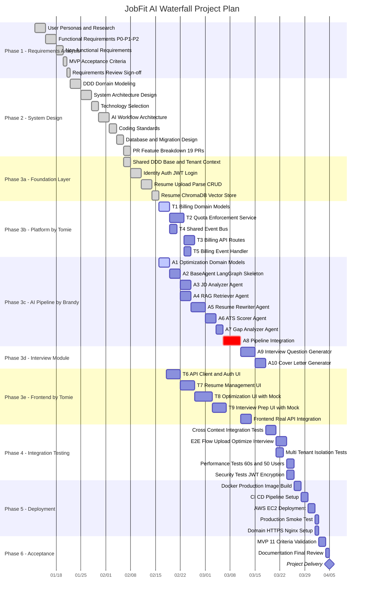

# JobFit AI — Waterfall Project Management Plan

> **Project**: JobFit AI — Intelligent Resume Optimization Agent (SaaS)
> **Team**: Tomie (Platform & Infrastructure) + Brandy (AI Workflow)
> **Methodology**: Waterfall
> **Total PRs**: 19 (Brandy 10 + Tomie 9)
> **Estimated LOC**: ~4,300 – 5,400

---

## 1. Waterfall Gantt Chart



---

## 2. Phase Descriptions

### Phase 1 — Requirements Analysis (DONE)

| Deliverable | Document |
|---|---|
| User personas, feature modules, priority matrix | `docs/01-requirements-analysis.md` |
| MVP acceptance criteria (11 items) | Included in above |
| Non-functional requirements (performance, security) | Included in above |

**Key Outputs:**
- 9 functional modules identified
- P0 (MVP-must), P1 (important), P2 (nice-to-have) priority levels
- 4 user personas: fresh graduates, career changers, overseas job seekers, high-volume applicants
- Tenant roles: individual, career center, recruitment agency, platform admin

---

### Phase 2 — System Design (DONE)

| Deliverable | Document |
|---|---|
| DDD layered architecture + 5 bounded contexts | `docs/02-system-architecture.md` |
| Technology selection | `docs/03-technology-selection.md` |
| Coding standards and conventions | `docs/04-technical-standards.md` |
| AI workflow architecture (LangGraph) | `docs/07-ai-workflow-architecture.md` |
| PR feature breakdown (19 PRs) | `docs/planning/PR_features.md` |

**Architecture Overview:**

```
Frontend (Next.js + TypeScript + Tailwind)
              |
        API Layer (FastAPI)
              |
   +----------+----------+----------+----------+
   |          |          |          |          |
Identity   Resume   Optimization Interview  Billing
   |          |          |          |          |
   +----------+----------+----------+----------+
              |
    Infrastructure Layer
   (PostgreSQL, Redis, ChromaDB, MinIO, Stripe)
```

**Bounded Context Ownership:**

| Context | Owner | Responsibility |
|---|---|---|
| `identity/` | Tomie | Auth, JWT, tenants, users |
| `resume/` | Tomie | PDF upload, parsing, vector store |
| `optimization/` | Brandy | LangGraph agents, RAG, ATS scoring |
| `interview/` | Brandy | Question generator, cover letter |
| `billing/` | Tomie | Subscriptions, quotas, usage |
| `shared/` | Both | Base classes, middleware |
| `frontend/` | Tomie | All frontend code |

---

### Phase 3 — Implementation (IN PROGRESS)

Phase 3 is divided into 5 sub-phases running in parallel across two developers.

#### Phase 3a — Foundation Layer (DONE)

| PR | Branch | Description | Status |
|---|---|---|---|
| — | `feature/shared-ddd-base` | DDD base classes, tenant context, middleware | DONE |
| — | `feature/identity-auth` | Registration, login, JWT auth flow | DONE |
| — | `feature/resume-upload-parse` | Resume upload, PDF parsing, CRUD | DONE |
| — | `feature/resume-vector-store` | ChromaDB vector store adapter | DONE |

#### Phase 3b — Platform Layer (Tomie)

| PR | Branch | Description | Est. LOC | Depends On |
|---|---|---|---|---|
| T1 | `feature/billing-domain-models` | Plan, Quota, Subscription entities | ~200-250 | shared |
| T2 | `feature/billing-quota-enforcement` | QuotaEnforcementService, ORM, Repository | ~300-350 | T1 |
| T4 | `feature/shared-event-bus` | InProcessEventBus (Observer pattern) | ~120-150 | shared |
| T3 | `feature/billing-api-routes` | GET /usage, GET /subscription, POST /subscribe | ~250-300 | T2 |
| T5 | `feature/billing-event-handler` | OptimizationCompleted event handler | ~100-150 | T2, T4 |

#### Phase 3c — AI Pipeline (Brandy)

| PR | Branch | Description | Est. LOC | Depends On |
|---|---|---|---|---|
| A1 | `feature/optimization-domain-models` | SessionStatus, JDAnalysis, ATSScore, GapReport | ~250-300 | shared |
| A2 | `feature/optimization-base-agent` | BaseAgent abstract class, LangGraph state schema | ~200-280 | A1 |
| A3 | `feature/optimization-jd-analyzer` | JD analysis: extract skills, responsibilities | ~150-200 | A2 |
| A4 | `feature/optimization-rag-retriever` | RAG retrieval from ChromaDB | ~150-200 | A2 |
| A5 | `feature/optimization-resume-rewriter` | Bullet point rewriting with GPT-4o | ~200-300 | A3, A4 |
| A6 | `feature/optimization-ats-scorer` | Rule-based + LLM scoring (0-1 scale) | ~200-280 | A5 |
| A7 | `feature/optimization-gap-analyzer` | Missing skills, transferable skills, priorities | ~120-180 | A6 |
| A8 | `feature/optimization-pipeline` | **CRITICAL** Full pipeline integration | ~350-400 | A3-A7, **T2** |

#### Phase 3d — Interview Module (Brandy)

| PR | Branch | Description | Est. LOC | Depends On |
|---|---|---|---|---|
| A9 | `feature/interview-question-gen` | 10+ categorized questions, STAR format answers | ~300-380 | A8 |
| A10 | `feature/interview-cover-letter` | 3 tones: formal, conversational, enthusiastic | ~150-200 | A9 |

#### Phase 3e — Frontend (Tomie)

| PR | Branch | Description | Est. LOC | Depends On |
|---|---|---|---|---|
| T6 | `feature/frontend-api-auth` | API client, AuthProvider, login/register pages | ~350-400 | identity API |
| T7 | `feature/frontend-resume-ui` | Upload, list, detail, delete UI | ~300-380 | T6 |
| T8 | `feature/frontend-optimization-ui` | JD input, ScoreCard, GapReport, progress | ~350-400 | T6, T7 |
| T9 | `feature/frontend-interview-ui` | InterviewPrep accordion, cover letter tone | ~250-300 | T6 |

---

### Phase 4 — Integration Testing

| Test Category | Description | Acceptance Criteria |
|---|---|---|
| Cross-context integration | Verify data flow between bounded contexts | All contexts communicate correctly |
| End-to-end flow | Upload resume → paste JD → optimize → interview prep | Full flow completes < 60s |
| Multi-tenant isolation | Tenant A cannot see Tenant B data | Automated test passes |
| Performance | Optimization pipeline benchmark | < 60s per session, 50 concurrent users |
| Security | JWT, bcrypt, AES-256, TLS 1.3 validation | No vulnerabilities found |

---

### Phase 5 — Deployment

| Step | Description | Target |
|---|---|---|
| Docker build | Production-optimized multi-stage images | GitHub Container Registry |
| CI/CD | GitHub Actions: lint → test → build → deploy | Automated pipeline |
| AWS EC2 | Single-instance Docker Compose deployment | EBS persistent storage |
| HTTPS | Nginx reverse proxy + Let's Encrypt SSL | TLS 1.3 |
| Smoke test | Production environment validation | All health checks pass |

---

### Phase 6 — Acceptance & Delivery

**MVP 11-Point Acceptance Checklist:**

| # | Criteria | Status |
|---|---|---|
| 1 | User can register, login, and manage sessions securely | Pending |
| 2 | Tenant data isolation verified with automated tests | Pending |
| 3 | Upload PDF resume and view parsed content | Pending |
| 4 | Paste JD and view extracted key requirements | Pending |
| 5 | Generate JD-aligned, ATS-optimized resume | Pending |
| 6 | Side-by-side comparison of original vs optimized | Pending |
| 7 | Clear skill gap analysis report | Pending |
| 8 | At least 8 relevant interview questions with answers | Pending |
| 9 | Download optimized resume as PDF | Pending |
| 10 | Optimization results persisted across sessions | Pending |
| 11 | Application deployed and publicly accessible | Pending |

---

## 3. Critical Path

The longest dependency chain that determines the project delivery date:

```
A1 → A2 → A3/A4 → A5 → A6 → A7 → A8 → A9 → A10 → Integration Testing → Deployment → Acceptance
```

**Key cross-team dependency:**

```
Tomie: T1 → T2 ──────────────► Brandy: A8 (calls check_quota)
Brandy: A8 (publishes event) ──► Tomie: T5 (records token usage)
Brandy: A8 API ready ──────────► Tomie: T8 (optimization UI connects to real API)
Brandy: A9-A10 API ready ─────► Tomie: T9 (interview UI connects to real API)
```

> **Risk mitigation**: Tomie must complete T1 + T2 before Brandy reaches A8. Since T2 is Tomie's 2nd PR and A8 is Brandy's 8th, there is sufficient buffer time.

---

## 4. Summary Statistics

| Metric | Value |
|---|---|
| Total PRs | 19 |
| Brandy (AI Workflow) | 10 PRs, ~2,070-2,720 LOC |
| Tomie (Platform) | 9 PRs, ~2,220-2,680 LOC |
| Waterfall Phases | 6 |
| Estimated Duration | ~8-10 weeks |
| Bounded Contexts | 5 + shared + frontend |
| Tech Stack | FastAPI, Next.js, LangGraph, PostgreSQL, Redis, ChromaDB, MinIO |
