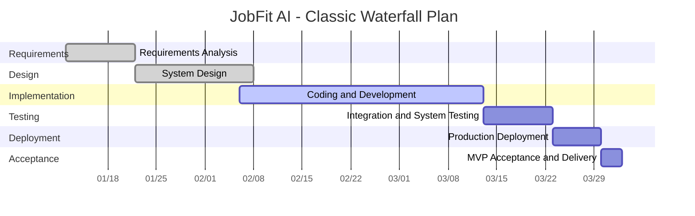

# JobFit AI — Waterfall Project Management Plan

> **Project**: JobFit AI — Intelligent Resume Optimization Agent (SaaS)
> **Team**: Tomie (Platform & Infrastructure) + Brandy (AI Workflow)
> **Methodology**: Waterfall
> **Estimated Duration**: ~8–10 weeks

---

## Waterfall Gantt Chart

---

## Phase Details

### Phase 1 — Requirements Analysis (DONE)

- **Duration**: Jan 12 – Jan 21
- **Deliverable**: `docs/01-requirements-analysis.md`
- **Scope**: User personas, 9 functional modules, P0/P1/P2 priority matrix, MVP acceptance criteria (11 items), non-functional requirements (performance, security, scalability)

### Phase 2 — System Design (DONE)

- **Duration**: Jan 22 – Feb 7
- **Deliverables**:
  - `docs/02-system-architecture.md` — DDD layered architecture, 5 bounded contexts
  - `docs/03-technology-selection.md` — Tech stack decisions
  - `docs/04-technical-standards.md` — Coding standards
  - `docs/07-ai-workflow-architecture.md` — LangGraph AI pipeline design
  - `docs/planning/PR_features.md` — 19 PR breakdown and dependency graph

### Phase 3 — Implementation (IN PROGRESS)

- **Duration**: Feb 6 – Mar 12
- **Scope**: 19 PRs across two parallel tracks
  - **Tomie**: shared, identity, resume, billing, event bus, frontend (9 PRs)
  - **Brandy**: optimization agents, pipeline integration, interview module (10 PRs)
- **Completed**: shared base, identity auth, resume CRUD, vector store
- **Remaining**: billing, optimization pipeline, interview module, frontend UI

### Phase 4 — Integration & System Testing

- **Duration**: Mar 13 – Mar 22
- **Scope**: End-to-end flow testing, cross-context integration, multi-tenant isolation verification, performance benchmarks (< 60s, 50 concurrent), security audit

### Phase 5 — Deployment

- **Duration**: Mar 23 – Mar 29
- **Scope**: Docker production builds, CI/CD pipeline, AWS EC2 deployment, HTTPS/Nginx, smoke testing

### Phase 6 — Acceptance & Delivery

- **Duration**: Mar 30 – Apr 1
- **Scope**: Validate all 11 MVP acceptance criteria, final documentation review, project handoff
